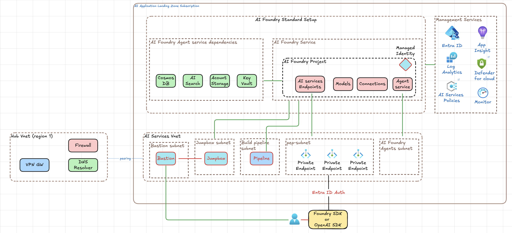
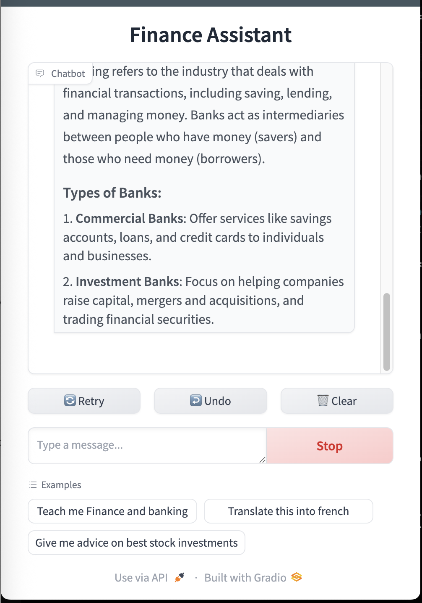

# Gradio Assistant

Gradio Assistant is an AI assistant application with both command-line and web interfaces, powered by Azure AI Foundry, Azure OpenAI's GPT-4o model and Gradio user interface.

Gradio Assistant is a secure and full private Terraform implemetation of the following AI guidelines: https://github.com/Azure/AI-Landing-Zones

## File Structure

```
gradio-assistant/
├── .gitignore
├── LICENSE
├── readme.md                # This documentation file
├── app/                     # Gradio application code
│   ├── gradio-app-ui.py         # Web interface application
│   ├── gradio-app-cli.py        # Command-line interface application
│   └── requirements.txt         # Python dependencies
├── assets/                  # Documentation assets
│   ├── ai-foundry-architecture.png
│   └── screen-001.png
└── foundry/                  # Terraform infrastructure (Azure AI Foundry, networking, security)
   ├── ai-foundry.tf            # AI Foundry workspace and model deployments
   ├── bastion.tf               # Azure Bastion configuration (optional)
   ├── dev.tfvars               # Development environment values
   ├── jumpbox.tf               # Jumpbox VM and related resources (optional)
   ├── keyvault.tf              # Key Vault for secrets and keys
   ├── main.tf                  # Root module composition
   ├── network.tf               # Virtual network, subnets, private endpoints
   ├── outputs.tf               # Output values
   ├── terraform.tf             # Provider/backend configuration
   └── variables.tf             # Input variables
```


## Infrastructure Deployment (Terraform)

The `foundry/` directory contains Terraform configuration for deploying Azure AI Foundry with secure networking, private endpoints, and customer-managed keys (CMK) via Azure Key Vault:




### Quick Deploy

```bash
cd foundry/
terraform init
terraform apply -var-file="dev.tfvars"
```


### Infrastructure Components

- **Azure AI Foundry** - GPT-4o model access with private networking
- **Virtual Network** - Private endpoints and agent subnets
- **Key Vault & CMK** - Customer-managed keys for encryption, with explicit role assignments for access
- **Network Security** - Private access only, public access disabled

### Required Configuration

Update `dev.tfvars` with your Azure details:
```bash
subscription_id = "your-subscription-id"
tenant_id      = "your-tenant-id"
resource_group_name = "rg-assistant"
```

### Cleanup

```bash
terraform destroy -var-file="dev.tfvars"
```


## UI Overview



This project provides two interfaces for interacting with an AI assistant:

1. **gradio-app-ui.py** - Web-based chat interface using Gradio
2. **gradio-app-cli.py** - Command-line interface for direct API interaction

 
## Requirements

- Python 3.7+
- Azure OpenAI subscription and API key
- Required Python packages (see requirements.txt)

## Installation

1. Clone or download this repository
2. Navigate to the app directory and install the required dependencies:

```bash
cd app/
pip install -r requirements.txt
```

3. Set up your Azure OpenAI API key as an environment variable:

```bash
export AI_FOUNDRY_KEY="your_azure_openai_api_key_here"
```

## Usage

### Web Interface (gradio-app-ui.py)

The web interface provides an interactive chat experience with predefined examples.

```bash
cd app/
./gradio-app-ui.py
```

**Features:**
- Interactive chat interface
- Message history preservation
- Predefined examples:
  - "Teach me Finance and banking"
  - "Translate this into french"
  - "Give me advice on best stock investments"
- Soft theme for comfortable viewing
- Real-time streaming responses

**Access:** Once started, the application will launch in your default web browser, typically at `http://localhost:7860`

### Command Line Interface (gradio-app-cli.py)

The CLI version provides a simple way to get responses directly in your terminal.

```bash
cd app/
./gradio-app-cli.py
```

**Customization:** Modify the `main()` function to change the default query or add interactive input.

## Configuration

### Azure OpenAI Settings

Both applications are pre-configured with the following settings:

- **Endpoint:** `https://ai-foundry-instance.cognitiveservices.azure.com/`
- **Model:** `gpt-4o`
- **API Version:** `2024-12-01-preview`
- **Temperature:** `0.3` (for consistent, focused responses)
- **Max Tokens:** `4096`
- **Top P:** `1.0`

### Environment Variables

| Variable | Description | Required |
|----------|-------------|----------|
| `AI_FOUNDRY_KEY` | Your Azure OpenAI API key | Yes |


## Error Handling

Both applications include comprehensive error handling:

- **Connection errors** - Handles Azure OpenAI service connectivity issues
- **API errors** - Manages authentication and quota-related errors
- **Streaming errors** - Gracefully handles interruptions in token streaming
- **User-friendly messages** - Displays clear error messages to users

## Development Notes

- The applications use the Azure OpenAI Python SDK
- Streaming is implemented with a small delay (0.03s) for smooth user experience
- The web interface maintains conversation history within the session
- The CLI interface processes single queries (can be extended for interactive mode)


## Troubleshooting

1. **"API key not found" error:**
   - Ensure `AI_FOUNDRY_KEY` environment variable is set
   - Verify the API key is valid and has proper permissions

2. **Connection timeout:**
   - Check your internet connection
   - Verify the Azure endpoint URL is correct
   - Confirm your Azure OpenAI service is active

3. **Import errors:**
   - Ensure all requirements are installed: `pip install -r requirements.txt`
   - Check Python version compatibility

4. **Terraform update fails with `ApiPropertiesInvalid` or `qnaAzureSearchEndpointKey` error:**
   - Azure may require `apiProperties.qnaAzureSearchEndpointKey` to be set (even if unused). In your `azapi_update_resource` block, add:
     ```hcl
     apiProperties = {
       qnaAzureSearchEndpointKey = ""
     }
     ```
   - See `foundry/ai-foundry.tf` for an example.

## License

This project is provided as-is for educational and development purposes.


